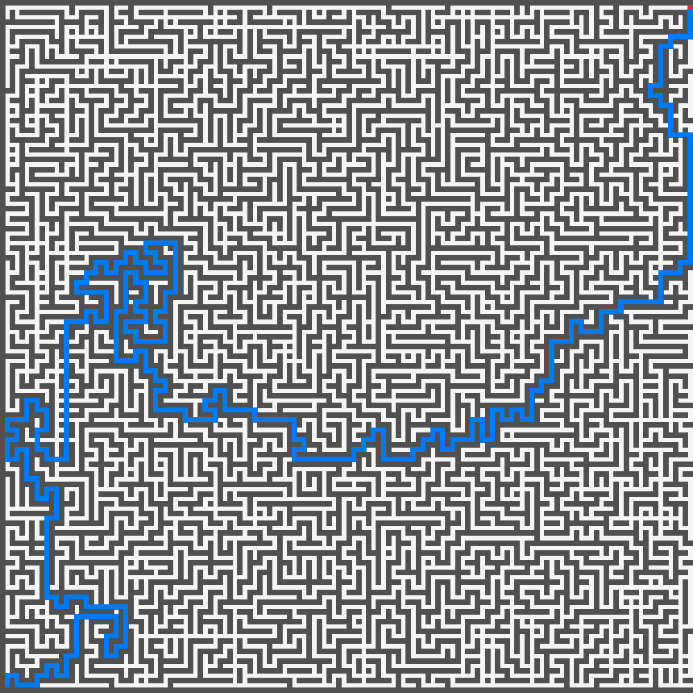

XAOC - Visualization collection for AoC problems
================================================

This project contains a collection of visualization programs that read
the output of your AoC solutions and display it on the screen. Read the
[Guide](#Guide) section if you want to *visualize your solutions*.

## Guide

To create a visualization of one of your solutions, you must first format
the output of your program to match the [format expected](#Formats) by the
visualization program. Then simply pipe it to the visualization program.

    $ ./your_program | xmaze

For convenience you can run your solutions with `xaoc`. This little program
will first set `$AOC_DISPLAY` environment variable to tell your program to
output the visualization format. Then it will read the first line of your
programs output (which should start with `visualizer: COMMAND` to know which
visualization program to run.

    $ xaoc ./your_program

We also recomend that your solutions read the input from a file located
in `$AOC_INPUT_DIR/YYYY/DD.data`. This way you can store the input data
outside of your source code and easily run your solutions with `xaoc`.

## Formats

*XAOC* is the program launcher. It reads the first line of the output of your
solutions to know which visualization program to run. The format is as follows:

    visualizer: COMMAND

*XMAZE* is the only visualization program available at the moment. It reads
a maze from the standard input and displays it on the screen. The maze is
formatted as follows:

    visualizer: xmaze
    | ##############
    | #...#........#
    | #...#.#.######
    | ##.####.######
    | #...OO.......#
    | #..#...##.####
    | ##############
    .

It is encouraged to format the *Results* as follows:

    @ Solution1=1
    @ Solution2=2

## TODO

This list is infinite.

1. Add more visualization programs.
2. Add timing calculation to `xaoc`.
3. Add a way to run all solutions at once.
4. Add a way to run all solutions for a given year.
5. Add a way to run all solutions for a given day.
6. Add timing graphs to `xmaze`.
7. Add title and subtitle to `xmaze` and other visualization programs.
8. Test with more solutions.
9. Add tests for visualization programs that serve as examples.
10. Add characters to `xmaze` to represent the player and the goal.

## Screenshots

*XMaze* visualization program displaying a maze.

## Style guide

This project follows the OpenBSD kernel source file style guide (KNF).

Read the guide [here](https://man.openbsd.org/style).

## Collaborating

For making bug reports, feature requests, support or consulting visit
one of the following links:

1. [gemini://harkadev.com/oss/](gemini://harkadev.com/oss/)
2. [https://harkadev.com/oss/](https://harkadev.com/oss/)
